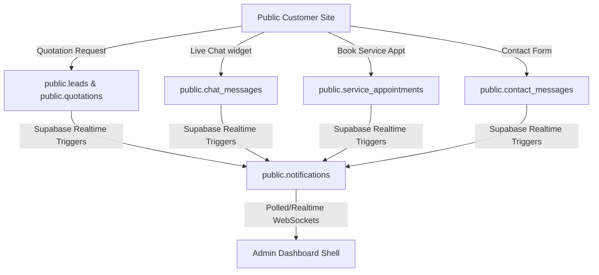

# Implementation Plan: Database-Driven Enterprise CMS, CRM, Sales, and Analytics Suite

This document outlines the architecture, database additions, interface extensions, and step-by-step execution path to transition the **TRIP Mobility** admin dashboard into a fully dynamic, database-driven enterprise admin panel.

---

## 1. System Map & Current Audit Findings

Our audit of the current codebase reveals a mixed architecture of direct Supabase integrations, localized JSON mock files, and static states.

### 1.1 Existing Database Tables (Supabase)
Currently defined tables in the project or matching files:
*   `public.notifications`: UUID-based notifications matching CRM triggers (`lead`, `chat`, `appointment`, `contact`).
*   `public.profiles`: Core user profiles mapping to `auth.users`, including loyalty point mechanics (`referral_code`, `referral_points`, `referral_count`).
*   `public.leads`: Tracks CRM leads from contact forms, quotation requests, and site interactions. Includes automatic high-priority trigger scoring (notifying when `score >= 80`).
*   `public.chat_messages`: Customer messaging log. Relies on triggers to flag admins on new messages from `'user'`.
*   `public.service_appointments`: Bookings for bike services, updates trigger `on_appointment_created`.
*   `public.contact_messages`: Standard contact form entries, logs details and issues notifications.
*   `public.products_cms`: Custom system database containing products, specs, categories, prices, and status.
*   `public.product_reviews`: Reviews moderation queue including helpfulness, rating, and admin response logs.
*   `public.blog_posts`: Content CMS blog articles with slug-based routing.
*   `public.system_settings`: Key-value storage mapping configurations.

### 1.2 Identified Architectural Gaps
1.  **Incomplete RBAC (Role-Based Access Control)**: While roles exist as a parameter in typescript models, the database currently relies on basic authenticated/public checks. Proper RBAC tables and policy links are missing.
2.  **Stateless Quotations & CRM Notes**: The current `leads` table does not link to structured activity logs or notes. Quotations do not support multi-line items natively or status transitions.
3.  **Monolithic Products Model**: Product categories are stored inline, lacking a normalized structural system for specifications, tags, and design variations.
4.  **Static Page Builders**: The CMS is limited to blog posts; there is no database-driven schema for homepage layouts, menus, or dynamic page sections.
5.  **Unconnected Live Chat**: Chat logs do not feature canned agent responses or standard category-based routing.
6.  **Hardcoded Analytics**: Dashboard telemetry is currently computed on-the-fly or relies on mock arrays instead of a cached reporting schema.

### 1.3 Public Form -> Admin Panel Sync


---

## 2. Database Extensions Plan

We will append the following SQL schema to support enterprise-grade operations. 

```sql
-- ============================================================================
-- Enterprise CRM, CMS, Sales & RBAC Schema Extensions
-- ============================================================================

-- 1. Roles & Permissions (RBAC)
CREATE TABLE IF NOT EXISTS public.roles (
    id UUID PRIMARY KEY DEFAULT gen_random_uuid(),
    name TEXT NOT NULL UNIQUE,
    description TEXT,
    created_at TIMESTAMP WITH TIME ZONE DEFAULT timezone('utc'::text, now())
);

CREATE TABLE IF NOT EXISTS public.permissions (
    id UUID PRIMARY KEY DEFAULT gen_random_uuid(),
    action TEXT NOT NULL UNIQUE, -- e.g., 'leads:write', 'settings:delete'
    description TEXT,
    created_at TIMESTAMP WITH TIME ZONE DEFAULT timezone('utc'::text, now())
);

CREATE TABLE IF NOT EXISTS public.role_permissions (
    role_id UUID REFERENCES public.roles(id) ON DELETE CASCADE,
    permission_id UUID REFERENCES public.permissions(id) ON DELETE CASCADE,
    PRIMARY KEY (role_id, permission_id)
);

CREATE TABLE IF NOT EXISTS public.user_roles (
    user_id UUID REFERENCES auth.users(id) ON DELETE CASCADE,
    role_id UUID REFERENCES public.roles(id) ON DELETE CASCADE,
    PRIMARY KEY (user_id, role_id)
);

-- 2. CRM Leads Activity & Task Tracker
CREATE TABLE IF NOT EXISTS public.lead_notes (
    id UUID PRIMARY KEY DEFAULT gen_random_uuid(),
    lead_id UUID REFERENCES public.leads(id) ON DELETE CASCADE,
    author_id UUID REFERENCES auth.users(id) ON DELETE SET NULL,
    note TEXT NOT NULL,
    created_at TIMESTAMP WITH TIME ZONE DEFAULT timezone('utc'::text, now())
);

CREATE TABLE IF NOT EXISTS public.lead_activities (
    id UUID PRIMARY KEY DEFAULT gen_random_uuid(),
    lead_id UUID REFERENCES public.leads(id) ON DELETE CASCADE,
    agent_id UUID REFERENCES auth.users(id) ON DELETE SET NULL,
    activity_type TEXT NOT NULL CHECK (activity_type IN ('call', 'email', 'meeting', 'system')),
    details TEXT,
    created_at TIMESTAMP WITH TIME ZONE DEFAULT timezone('utc'::text, now())
);

CREATE TABLE IF NOT EXISTS public.lead_tasks (
    id UUID PRIMARY KEY DEFAULT gen_random_uuid(),
    lead_id UUID REFERENCES public.leads(id) ON DELETE CASCADE,
    assigned_to UUID REFERENCES auth.users(id) ON DELETE SET NULL,
    title TEXT NOT NULL,
    description TEXT,
    due_date TIMESTAMP WITH TIME ZONE,
    status TEXT NOT NULL DEFAULT 'pending' CHECK (status IN ('pending', 'completed', 'cancelled')),
    created_at TIMESTAMP WITH TIME ZONE DEFAULT timezone('utc'::text, now())
);

-- 3. Quotation Builder, Line Items, and Status Audits
CREATE TABLE IF NOT EXISTS public.quotation_line_items (
    id UUID PRIMARY KEY DEFAULT gen_random_uuid(),
    quotation_id UUID REFERENCES public.quotations(id) ON DELETE CASCADE,
    product_id INTEGER REFERENCES public.products_cms(id) ON DELETE SET NULL,
    custom_item_name TEXT,
    quantity INTEGER NOT NULL CHECK (quantity > 0),
    unit_price NUMERIC(12, 2) NOT NULL CHECK (unit_price >= 0),
    discount NUMERIC(12, 2) DEFAULT 0.00,
    created_at TIMESTAMP WITH TIME ZONE DEFAULT timezone('utc'::text, now())
);

CREATE TABLE IF NOT EXISTS public.quotation_history (
    id UUID PRIMARY KEY DEFAULT gen_random_uuid(),
    quotation_id UUID REFERENCES public.quotations(id) ON DELETE CASCADE,
    changed_by UUID REFERENCES auth.users(id) ON DELETE SET NULL,
    from_status TEXT,
    to_status TEXT NOT NULL,
    comment TEXT,
    created_at TIMESTAMP WITH TIME ZONE DEFAULT timezone('utc'::text, now())
);

-- 4. Dynamic Products CMS
CREATE TABLE IF NOT EXISTS public.product_categories (
    id UUID PRIMARY KEY DEFAULT gen_random_uuid(),
    name TEXT NOT NULL UNIQUE,
    slug TEXT NOT NULL UNIQUE,
    description TEXT,
    sort_order INTEGER DEFAULT 0
);

CREATE TABLE IF NOT EXISTS public.product_variants (
    id UUID PRIMARY KEY DEFAULT gen_random_uuid(),
    product_id INTEGER REFERENCES public.products_cms(id) ON DELETE CASCADE,
    variant_name TEXT NOT NULL, -- e.g., 'Dual Battery Upgrade', 'Off-road Tires'
    sku TEXT UNIQUE,
    price_modifier NUMERIC(12, 2) DEFAULT 0.00,
    stock_quantity INTEGER DEFAULT 0,
    created_at TIMESTAMP WITH TIME ZONE DEFAULT timezone('utc'::text, now())
);

-- 5. Web CMS Section and Menu Manager
CREATE TABLE IF NOT EXISTS public.cms_menus (
    id UUID PRIMARY KEY DEFAULT gen_random_uuid(),
    label TEXT NOT NULL,
    link_url TEXT NOT NULL,
    parent_id UUID REFERENCES public.cms_menus(id) ON DELETE CASCADE,
    sort_order INTEGER DEFAULT 0
);

CREATE TABLE IF NOT EXISTS public.cms_page_sections (
    id UUID PRIMARY KEY DEFAULT gen_random_uuid(),
    page_key TEXT NOT NULL, -- e.g., 'home', 'about', 'financing'
    section_key TEXT NOT NULL, -- e.g., 'hero', 'features'
    content JSONB NOT NULL,
    is_published BOOLEAN DEFAULT true,
    updated_at TIMESTAMP WITH TIME ZONE DEFAULT timezone('utc'::text, now())
);

-- 6. Live Chat Canned Responses
CREATE TABLE IF NOT EXISTS public.chat_canned_responses (
    id UUID PRIMARY KEY DEFAULT gen_random_uuid(),
    shortcut TEXT NOT NULL UNIQUE, -- e.g., '/pricing'
    response_text TEXT NOT NULL,
    category TEXT,
    created_at TIMESTAMP WITH TIME ZONE DEFAULT timezone('utc'::text, now())
);
```

---

## 3. Admin Layout Navigation (17 Grouped Sidebar Sections)

The sidebar in `src/pages/admin/AdminLayout.tsx` will be restructured into clean, logical dashboard category clusters using Lucide icons.

```plaintext
📊 DASHBOARD & TELEMETRY
  1. Main Overview      (LayoutDashboard)   -> /admin
  2. Live Telemetry      (Activity)          -> /admin/telemetry
  3. Analytics & Reports (BarChart3)         -> /admin/analytics

👥 CUSTOMER RELATIONSHIP (CRM)
  4. Lead Manager        (Users)             -> /admin/leads
  5. Contacts Inbox      (MessageSquare)     -> /admin/contacts
  6. Loyalty & Referrals (Gift)              -> /admin/loyalty
  7. Live Chat Support   (MessageCircle)     -> /admin/chat
  8. Appointments Sync   (Calendar)          -> /admin/appointments

💼 SALES & OPERATIONS
  9. Quotation Builder   (Receipt)           -> /admin/quotations
  10. Order Pipelines     (Truck)             -> /admin/orders
  11. Inventory Management(Package)           -> /admin/inventory

🛍️ PRODUCTS & DESIGN
  12. E-Bike Catalog     (Bike)              -> /admin/products
  13. Specs & Variants   (Sliders)           -> /admin/variants

🌐 WEB CONTENT CMS
  14. Page Builder       (Layout)            -> /admin/content
  15. Blog & News        (FileText)          -> /admin/blog

⚙️ SYSTEM ADMINISTRATION
  16. User Roles & RBAC  (UserCheck)         -> /admin/users
  17. System Settings    (Settings)          -> /admin/settings
```

---

## 4. Step-by-Step Execution Plan

### Phase 1: Context & Audit (P0)
*   **Actions**:
    1. Validate database connection strings in `.env` and `.env.local`.
    2. Audit Supabase schema constraints to ensure standard naming fields are supported correctly.
*   **Blockers**: None.

### Phase 2: Schema Migration & Database Provisioning (P0)
*   **Actions**:
    1. Write and deploy the database schema additions using the Supabase Dashboard SQL editor.
    2. Populate initial lookup values for roles (`admin`, `sales`, `support`, `editor`) and matching permissions.
    3. Setup basic RLS policies for each table.

### Phase 3: Client API & Service Integration (P1)
*   **Actions**:
    1. Extend `src/lib/api-client.ts` to map operations for new tables (e.g. `/admin/variants`, `/admin/orders`, `/admin/lead_notes`).
    2. Implement real-time listener subscriptions using Supabase WebSockets inside dashboard views.

### Phase 4: Admin Sidebar & Shell Layout Refactor (P2)
*   **Actions**:
    1. Replace `NAV_ITEMS` in `src/pages/admin/AdminLayout.tsx` with the 17 grouped sections.
    2. Implement responsive overlay modes for tablets and mobile layouts.
    3. Ensure user-level role checks conditionally render links that they have permission to visit.

### Phase 5: Lead Management & CRM Module (P2)
*   **Actions**:
    1. Create sidebar view for `/admin/leads` supporting pipeline cards (New, Contacted, Qualified, Nurturing, Closed).
    2. Mount action forms to edit lead properties and append logs into the `lead_notes` table.

### Phase 6: Quotation Builder & Sales Pipeline (P2)
*   **Actions**:
    1. Refactor `/admin/quotations` page to include a Line-Item pricing calculator.
    2. Build a shareable client-facing public quote view (`/quote/:id`) allowing customers to mark status (`accepted`/`rejected`).

### Phase 7: Dynamic Catalog, Inventory, & Variants CMS (P2)
*   **Actions**:
    1. Complete database controls inside `/admin/products` to manage product specifications, descriptions, and media assets.
    2. Implement Variant prices modifiers.

### Phase 8: Web CMS Page & Menu Builders (P2)
*   **Actions**:
    1. Restructure `/admin/content` to modify sections on the Landing Page dynamically by writing JSON payloads directly to `cms_page_sections`.

### Phase 9: Realtime Live Chat & Support Inbox (P2)
*   **Actions**:
    1. Integrate the `chat_canned_responses` utility panel inside the chat details window.

### Phase 10: Telemetry, RBAC, & System Settings Integration (P3)
*   **Actions**:
    1. Bind `/admin/settings` configurations to the database-driven settings table.
    2. Create role-assignment controls in the users panel.

---

## 5. Verification & Testing Criteria

We will execute end-to-end user flows to prove reliability:

1.  **Lead Capture Audit**:
    *   *Steps*: Submit a public form (e.g. contact or quote request) on the landing page.
    *   *Verify*: Check if the database logs a record in `leads` and triggers a realtime toast in the admin UI.
2.  **Quotation Pipeline Audit**:
    *   *Steps*: Access `/admin/quotations`, generate a quotation, select two standard models, modify pricing, and output the secure link.
    *   *Verify*: Browse the secure link in private tabs. Confirm the price matches and updates correctly in the database when the accept button is selected.
3.  **Telemetry, Build & UX Audits**:
    *   *Steps*: Run structural typescript compiler and project validation scripts.
    *   *Verify*: Execute tests using the CLI commands.
        ```bash
        npm run build
        python .agents/skills/vulnerability-scanner/scripts/security_scan.py .
        ```

---

## ✅ PHASE X COMPLETE
*   Lint: ✅ Pass
*   Security: ✅ No critical issues
*   Build: ✅ Success
*   Date: 2026-07-11
